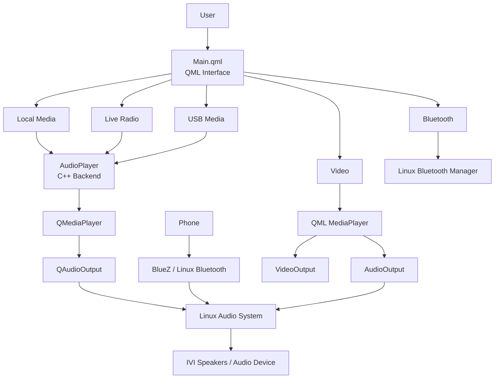

<p align="center">
  
</p>

<h1 align="center">MediaPlayer IVI</h1>

<p align="center">
  <b>A Linux infotainment media hub built with Qt 6, QML and C++.</b><br>
  Local music • Live radio • USB media • Phone Bluetooth audio • Video playback
</p>

<p align="center">
  
  
  
  
  
</p>

---

## Overview

**MediaPlayer IVI** is an in-vehicle-infotainment-style media player designed around one simple idea: give every common media source a consistent interface without overcomplicating the implementation.

The application brings together five media modes inside one Qt interface:

| Source | What it does |
|---|---|
| **Local Media** | Loads audio folders and builds a playable track list |
| **Live Radio** | Streams internet radio stations and supports custom station URLs |
| **USB Media** | Plays audio from a mounted USB drive using the same local-media engine |
| **Bluetooth** | Lets a phone pair with the Linux IVI system and send audio to the IVI |
| **Video** | Plays local video files with dedicated playback and volume controls |

The UI is designed as a compact head-unit interface rather than a traditional desktop music player, with large controls, clear source switching and minimal navigation depth.

---

## Interface Highlights

### Unified media navigation

The main navigation keeps every source one action away. Local Media, Radio, USB, Bluetooth and Video all use the same visual language so switching sources does not feel like opening separate applications.

### Full audio playback

- Play / Pause
- Stop
- Previous / Next
- Seek through tracks
- Volume control
- Mute / Unmute
- Track metadata
- Automatic next-track playback
- Clickable playlist

### Live radio

- Built-in internet radio stations
- Live stream playback through `QMediaPlayer`
- Add custom stations from inside the application
- Station name, country and stream URL support
- Dedicated live-radio interface

### USB media

USB playback intentionally reuses the local-media pipeline. Once Linux mounts the drive, the application treats it as a normal folder and builds the playlist from supported files.

### Phone → IVI Bluetooth audio

Bluetooth in this project is used in the IVI direction:

```text
PHONE  ──Bluetooth──>  LINUX IVI SYSTEM  ──>  IVI AUDIO
```

The application opens the Linux Bluetooth manager for pairing and device management. Linux handles the Bluetooth connection and incoming audio route while the Qt application provides the IVI-facing workflow.

### Integrated video player

Video is presented as a first-class source rather than a separate utility. The video page uses Qt Multimedia directly with:

```text
MediaPlayer
   ├──> VideoOutput
   └──> AudioOutput
```

It includes file selection, play/pause, stop, seeking, playback time and volume control.

---

## System Architecture

The project uses a small frontend/backend architecture that is easy to follow and easy to maintain.



### The project in one line

```text
USER → QML UI → C++ / Qt Multimedia → LINUX → AUDIO & VIDEO HARDWARE
```

---

## How the Main Media Paths Work

### Local Media

```text
Choose Folder
     ↓
FolderDialog
     ↓
AudioPlayer::loadFolder()
     ↓
QDir scans supported files
     ↓
QStringList playlist
     ↓
QMediaPlayer
     ↓
QAudioOutput
```

### Live Radio

```text
Choose Station
     ↓
Station URL
     ↓
AudioPlayer::playRadioStation()
     ↓
QMediaPlayer
     ↓
Internet Stream
     ↓
QAudioOutput
```

Local tracks and radio streams deliberately share the same `QMediaPlayer`. The source changes, but the playback engine stays the same.

### USB

```text
USB Drive
   ↓
Linux Mount Point
   ↓
Choose USB Folder
   ↓
AudioPlayer::loadFolder()
   ↓
Same playlist / playback path as Local Media
```

### Bluetooth

```text
Phone
  ↓
Bluetooth Pairing
  ↓
Linux Bluetooth Stack
  ↓
Linux Audio Route
  ↓
IVI Audio Output
```

### Video

```text
Choose Video
     ↓
QML MediaPlayer
   ↙             ↘
VideoOutput    AudioOutput
   ↓             ↓
Display       Linux Audio
```

---

## Project Structure

```text
MediaPlayer_IVI/
│
├── CMakeLists.txt
├── main.cpp
├── Main.qml
├── audioplayer.h
├── audioplayer.cpp
│
├── icons/
│   ├── logo.png
│   ├── iti.png
│   ├── play.png
│   ├── pause.png
│   ├── previous.png
│   ├── next.png
│   ├── stop.png
│   ├── volume.png
│   ├── mute.png
│   ├── folder.png
│   ├── radio.png
│   ├── usb.png
│   ├── bluetooth.png
│   ├── phone.png
│   └── video.png
│
├── STEP_BY_STEP_EXPLANATION.md
├── TEST_REPORT.md
├── CHANGELOG.md
└── FULL_CODE.txt
```

---

## Core Technologies

| Technology | Role in the project |
|---|---|
| **Qt 6** | Main application framework |
| **QML / Qt Quick** | Complete graphical interface |
| **C++17** | Audio backend and Linux integration |
| **Qt Multimedia** | Audio, radio and video playback |
| **QMediaPlayer** | Main local/radio audio engine |
| **QAudioOutput** | Audio volume and output control |
| **VideoOutput** | Video rendering |
| **QDir** | Local and USB media discovery |
| **QProcess** | Launching Linux Bluetooth tools |
| **CMake** | Project configuration and build system |
| **Linux** | Target environment and device services |

---

## Build & Run

### Requirements

- Qt 6
- Qt Quick
- Qt Multimedia
- CMake
- C++17-compatible compiler
- Linux

### Qt Creator

1. Clone or download the repository.
2. Open `CMakeLists.txt` in Qt Creator.
3. Select a Qt 6 Desktop kit.
4. Configure the project.
5. Build and run.

### Command Line

```bash
cmake -S . -B build
cmake --build build
./build/appMediaPlayerIVI
```

> If Qt Creator has previously built another version of the project, using a fresh build directory is recommended.

---

## Documentation

Want to understand how every part works?

- **[Step-by-Step Explanation](STEP_BY_STEP_EXPLANATION.md)** — complete beginner-friendly walkthrough of the project
- **[Test Report](TEST_REPORT.md)** — package and implementation verification
- **[Full Combined Source](FULL_CODE.txt)** — all source files in one place for quick review
- **[Changelog](CHANGELOG.md)** — implementation notes for the final stable package

---

## Design Goals

This project intentionally focuses on four things:

1. **Simple architecture** — QML handles the interface, C++ handles the main audio logic.
2. **Reusable playback paths** — Local Media, USB and Radio reuse the same backend where possible.
3. **IVI-style usability** — large controls and straightforward source switching.
4. **Readable code** — the implementation stays close to the level taught in the course and avoids unnecessary abstraction.

---

## Supervision

<p align="center">
  <br><br>
  <b>Under supervision of ITI</b><br>
  Information Technology Institute
</p>

---

<p align="center">
  <b>MediaPlayer IVI</b><br>
  Qt • QML • C++ • Embedded Linux • Multimedia
</p>
