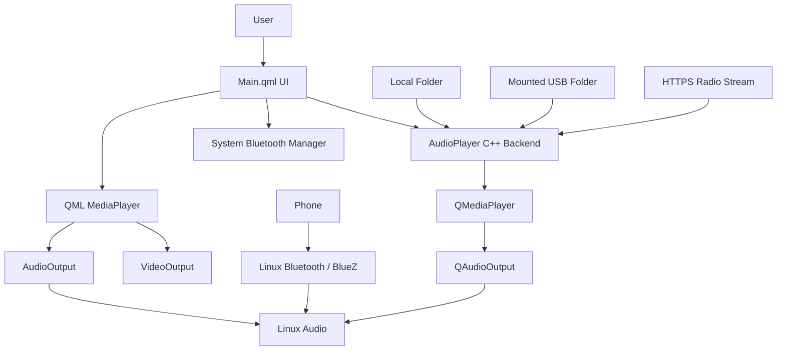

# MediaPlayer IVI

A Qt 6 / QML / C++ in-vehicle infotainment media player developed for the ITI Embedded Linux final project.

The application combines local music, internet radio, USB media, phone-to-IVI Bluetooth audio, and local video playback in one interface.

## Features

- Local audio folders
- Internet radio with custom station support
- USB audio folders
- Bluetooth phone audio receiver workflow
- Local video playback
- Play / Pause / Stop / Next / Previous
- Audio and video seeking
- Volume and mute controls
- Audio metadata display
- ITI supervision splash screen

## Architecture



## Bluetooth direction

Bluetooth in this project means:

```text
PHONE -> BLUETOOTH -> IVI SYSTEM -> IVI SPEAKERS
```

The application does not try to run several `bluetoothctl` commands itself anymore. The **Pair Phone** and **Bluetooth Devices** buttons safely open the Linux Bluetooth manager using `QProcess::startDetached()`.

Pairing and the incoming Bluetooth audio route are handled by Linux. This keeps the Qt application simple and avoids blocking or unstable Bluetooth command execution inside the GUI process.

## Radio stability

The radio implementation was hardened after runtime testing exposed crashes with the first version.

The current version:

- uses HTTPS default station URLs published by the MP3Quran radio API;
- validates custom station URLs before saving them;
- stops and clears the previous media source before switching stations;
- queues the new live source for the next Qt event-loop turn;
- does **not** run the normal End-of-Media auto-next logic for live streams;
- reports a failed stream through the normal error dialog instead of rapidly cycling through stations.

This keeps local-file auto-next behavior while treating live streams separately.

## Build

Open `CMakeLists.txt` in Qt Creator and select a Qt 6 Desktop kit with:

- Qt Quick
- Qt Multimedia
- C++17 support

A fresh build directory is recommended when switching between project versions.

## Main files

- `Main.qml` — complete UI, audio controls, radio interface, Bluetooth page, splash screen, and video player
- `audioplayer.h` — C++ backend interface exposed to QML
- `audioplayer.cpp` — local audio, playlist, radio, and Linux Bluetooth-manager integration
- `main.cpp` — application startup and QML type registration
- `CMakeLists.txt` — Qt project configuration
- `STEP_BY_STEP_EXPLANATION.md` — detailed explanation of the whole project
- `TEST_REPORT.md` — internal verification for this package
- `FULL_CODE.txt` — all source files combined for easy review
- `CHANGELOG.md` — summary of the radio/Bluetooth stability fixes

## Project flow in one line

```text
USER -> QML -> C++ BACKEND -> QT MULTIMEDIA -> LINUX -> HARDWARE
```

Video follows a direct QML multimedia path:

```text
QML MediaPlayer -> VideoOutput
                -> AudioOutput
```

Bluetooth follows the operating-system path:

```text
PHONE -> Linux Bluetooth stack -> Linux audio -> IVI speakers
```

## Supervision

The splash screen includes:

**Under supervision of ITI — Information Technology Institute**
